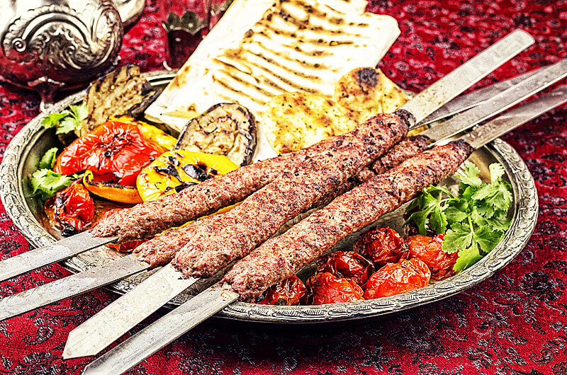
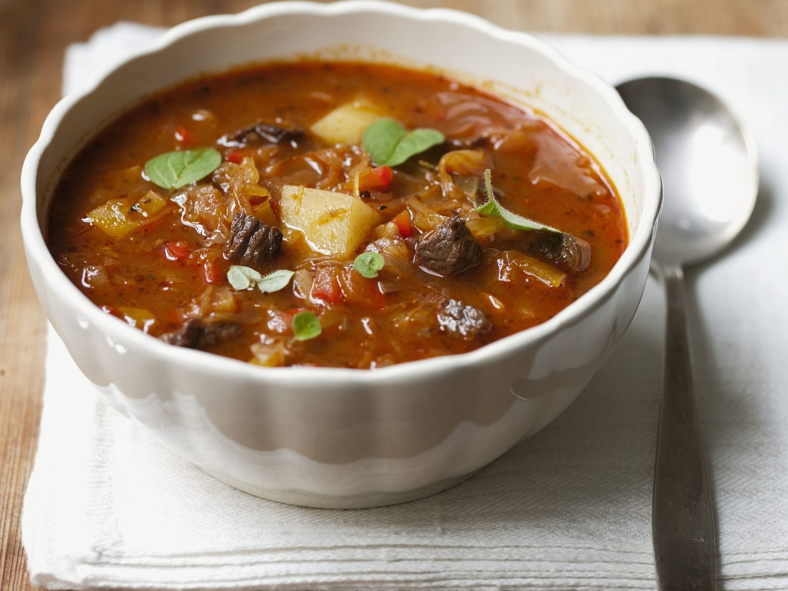

**Zwei meine lieblingsrezepte:**

# Kabab Kubideh | Rezept

Kabab Kubideh - persischer Hackfleischspieß
Zutaten (für 4 Portionen):

- 1/2 kg Lammfaschiertes
- 1/2 kg Rindfaschiertes
- 3 Zwiebel
- 1 TL Safran
- 2 TL Sumach
- 2 TL Kurkuma
- Salz, Pfeffer
- Kabab-Spieße (aus Metall mit flacher Klinge)

###Kabab Kubideh: der Klassiker unter den persischen Grillspießen

Kabab gehört zu den typischen Gerichten des Iran, hat aber mit dem bekannten türkischen Drehspieß gar nichts gemein. In der persischen Variante wird das Fleisch auf dünne flache Metallspieße gesteckt und am Holzkohlengrill zubereitet. Entscheidend für die Qualität ist die Qualität und Zartheit des Fleisches, gerade die persische Küche lebt von der Güte ihrer Zutaten. Die Feinheit der Rezeptkomposition und die Gewürzwahl ist darauf abgestimmt. Die typischen langen, abgeflachten Spieße und die Zubereitung am Holzkohlengrill geben dem persischen Kabab seinen einzigartigen, unverwechselbaren Geschmack.

# Gulaschsuppe | Rezept

Gulaschsuppe nach ungarischer Art
Zutaten (für 4 Portionen):

- 600g Rindfleisch küchenfertig, aus der Schulter
- 400g festkochende Kartoffeln
- 300g Zwiebeln
- 2    Knoblauchzehen
- 2    rote Paprikaschoten
- 1    rote Chilischote
- 2 EL Butter
- 2 EL edelsüßes Paprikapulver
- 3 EL Tomatenmark
- 1⅓l  Rindfleischbrühe
- 1    Lorbeerblatt
- 1 TL Kümmelsamen
- 3    Pfefferkörner 
       Salz 
       Pfeffer aus der Mühle
- 2Stiele Majoran

### Zubereitungsschritte

1-
    Fleisch waschen, trocken tupfen und in mundgerechte Stücke schneiden. Kartoffeln schälen, waschen und ebenfalls in mundgerechte Stücke schneiden.

2-
    Zwiebeln und Knoblauch schälen, Zwiebel in feine Streifen schneiden und Knoblauch fein hacken.

3-
    Paprikaschote halbieren, entkernen, waschen und in Würfel schneiden. Chilischote längs halbieren, entkernen, waschen und hacken.

4-
    In einem Topf Butter erhitzen und Fleisch portionsweise rundherum bei starker Hitze anbraten. Mit Paprikapulver würzen, herausnehmen und beiseitestellen.

5-
    Zwiebeln, Knoblauch und Chili im Bratenfett anbraten, Tomatenmark einrühren, mit Fleischbrühe ablöschen. Fleisch wieder einlegen und bei mittlerer Hitze etwa 1 1/2 Stunden schmoren lassen.

6-
    Zwischenzeitlich Lorbeerblatt, Kümmelsamen und Pfefferkörner in ein Teefilter geben. Nach etwa 1 Stunde zusammen mit Paprika und Kartoffeln zugeben und mitgaren.

7-
    Die ungarische Gulaschsuppe mit Salz und Pfeffer abschmecken, Gewürze entfernen und die Suppe in vorgewärmten Schälchen anrichten. Majoran waschen, trocken schütteln, Blättchen abzupfen und Suppe damit bestreut servieren.

  ###  Bon Appétit